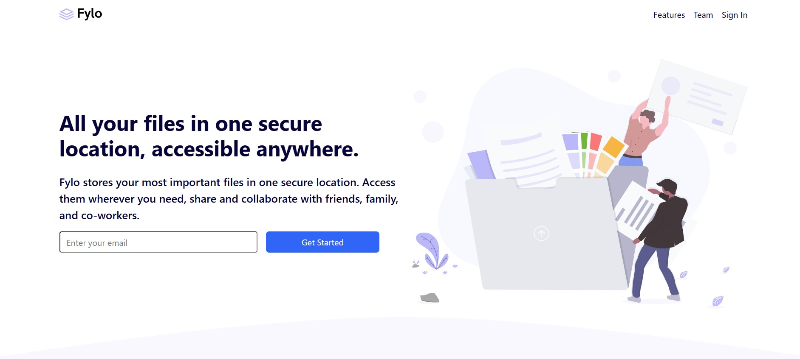

# Frontend Mentor - Fylo landing page with two column layout solution

This is a solution to the [Fylo landing page with two column layout challenge on Frontend Mentor](https://www.frontendmentor.io/challenges/fylo-landing-page-with-two-column-layout-5ca5ef041e82137ec91a50f5). Frontend Mentor challenges help you improve your coding skills by building realistic projects. 

## Table of contents

- [Overview](#overview)
  - [The challenge](#the-challenge)
  - [Screenshot](#screenshot)
  - [Links](#links)
- [My process](#my-process)
  - [Built with](#built-with)
  - [What I learned](#what-i-learned)
  - [Continued development](#continued-development)
- [Author](#author)

## Overview

### The challenge

Users should be able to:

- View the optimal layout for the site depending on their device's screen size
- See hover states for all interactive elements on the page

### Screenshot



### Links

- Solution URL: [Github](https://github.com/Diego2Drm/Fylo-landing-page)
- Live Site URL: [Fylo landing page with two column layout](https://fylo-landing-page-diego-2d.netlify.app/)

## My process

### Built with

- Semantic HTML5 markup
- CSS custom properties
- Flexbox
- Mobile-first workflow
- [Sass](https://sass-lang.com/) - CSS Sass preprocessor 
- [Bootstrap 5](https://getbootstrap.com/) - Css framework

### What I learned

I learned use Bootstrap 5 with CSS Sass preprocessor 

Example:

```html
<footer class="container-fluid bg-Very-Da-rk-Blue p-5 text-Light-Gray position-relative">
   <section class="row gap-5">
    <div class="col-lg-2">
      
      <p class="d-flex align-items-center column-gap-3">
        
        <span>Phone: +1-543-123-4567</span>
      </p>
      <p class="d-flex align-items-center column-gap-3">
        
        <span>example@fylo.com</span>
      </p>
    </div>
    <div class="col-lg-2 offset-lg-1">
      <ul class="list-unstyled d-flex flex-column row-gap-3">
        <li><a class="link-Light-Gray link-underline-opacity-0 link-underline link-opacity-50-hover" href="#">About Us</a></li>
        <li><a class="link-Light-Gray link-underline-opacity-0 link-opacity-50-hover link-underline" href="#">Jobs</a></li>
        <li><a class="link-Light-Gray link-underline-opacity-0 link-opacity-50-hover link-underline" href="#">Press</a></li>
        <li><a class="link-Light-Gray link-underline-opacity-0 link-opacity-50-hover link-underline" href="#">Blog</a></p>
      </ul>
    </div>
    </footer>
```

### Continued development

- [Sass](https://sass-lang.com/) - CSS Sass preprocessor 
- [Bootstrap 5](https://getbootstrap.com/) - Css framework

## Author

- Frontend Mentor - [@Diego2Drm](https://www.frontendmentor.io/profile/Diego2Drm)